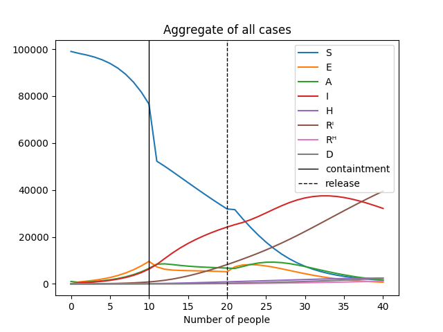

This repository contains the code for the **decoupled** Covid-19 epidemic model of Alex Arenas et al. described in \[[1,](https://covid-19-risk.github.io/map/model.pdf) [2](https://www.medrxiv.org/content/10.1101/2020.04.06.20054320v1.full.pdf)]. 

The function `iterate_model` in `arenas_model.py` runs by passing initial conditions, parameters, and the number of days to simulate.

The script `test.ty` makes a very simple simulation using the paremeters reported in [[2]](https://www.medrxiv.org/content/10.1101/2020.04.06.20054320v1.full.pdf) with artificial data on the initial conditions and total population. The figure below shows a typical output of the simulation by imposing containtment and release measures. 

